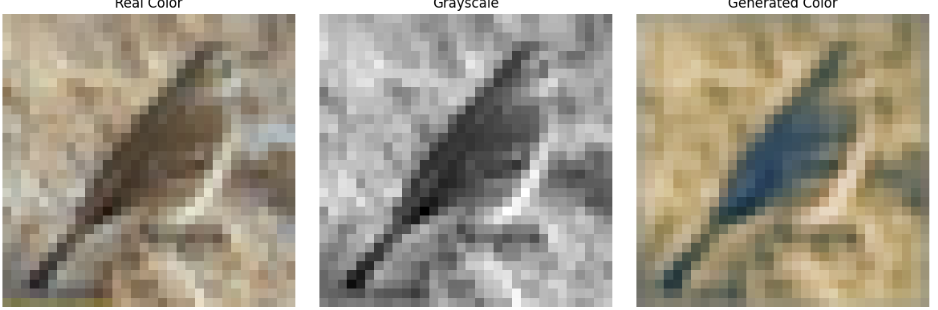
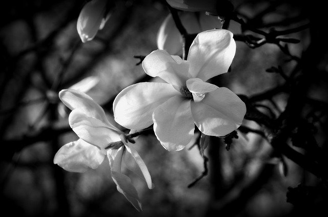
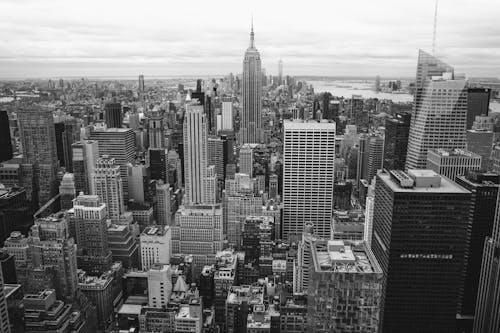
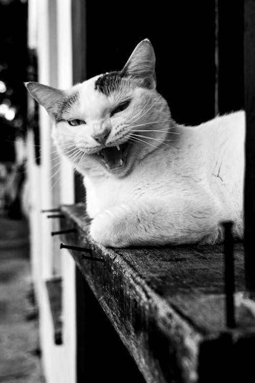
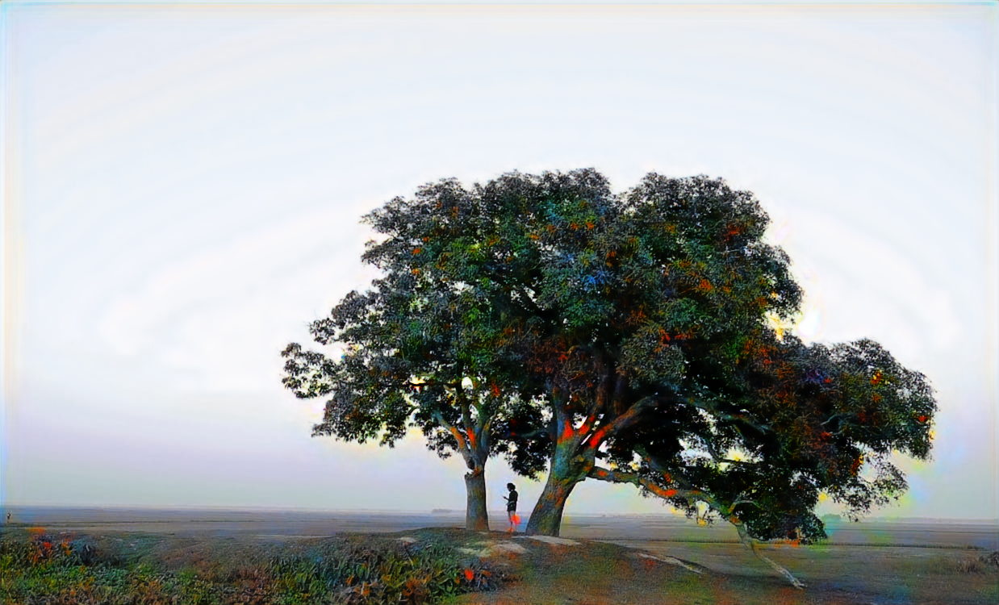
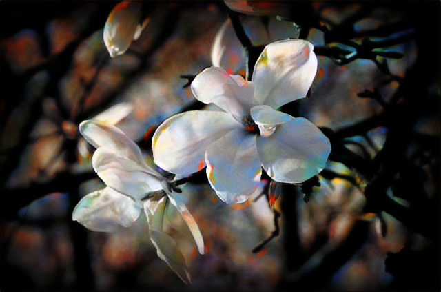
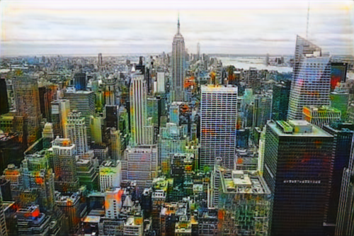
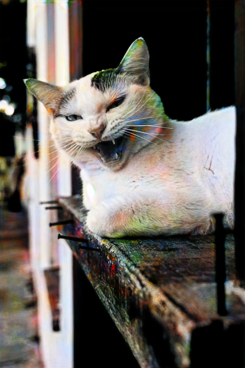

# MoreColors

## Live Demo: https://morecolors.onrender.com/

This is a deep learning project for automatic colorization of grayscale images using GANs (Generative Adversarial Networks). The goal was to take a black-and-white image and predict a realistic colored version.

The project was designed and trained entirely in Google Colab using limited GPU resources (T4).

## Features:
- Generator: U-Net style architecture that takes a grayscale image and outputs a colored image.
- Discriminator: CNN-based network that judges whether a colored image is real or generated.
- Flexible image sizes: The model can handle different input sizes without being restricted to a fixed resolution.
- Training on small datasets: Optimized to learn from fewer images, but higher resolution (e.g., 128x128), instead of massive datasets like CIFAR-10.

## Challenges and Solutions:

Color blobs / artifacts:
- When training, generated images often had large, unrealistic color patches.
- Experimented with different loss weights, normalization layers, and dropout in the discriminator to stabilize learning.

Unstable generator vs. discriminator:
- Sometimes the discriminator would dominate, causing the generator to fail, or vice versa.
- Implemented gradient clipping, careful learning rate scheduling, and experimented with label smoothing to balance the GAN training.

Normalization issues:
- Tried BatchNorm, InstanceNorm, and GroupNorm.
- Found BatchNorm worked better for stability in this setup, but GroupNorm allowed some flexibility for variable batch sizes.

Limited computational resources:
- Training on a T4 GPU in Colab with batch size 16.
- Had to carefully optimize memory usage, reduce image size when needed, and use gradient clipping and efficient DataLoader settings (num_workers, pin_memory).

### version 1:
| 1                                  | 2                                   |
|------------------------------------|-------------------------------------|
|  |  |

### version 2:
| 1238x750px                           | 640x423px                           | 500x333px                            | 500x750px                            |
|--------------------------------------|-------------------------------------|--------------------------------------|--------------------------------------|
|  |  |  |  |
|      |     |      |      |

## Limitations
- Trained on low-res (128×128) images -> show color patches on bigger images.
- Dataset was general-purpose -> may struggle with niche or unusual images.
- GPU & resources: trained on T4 in Colab, so results depend on hardware.
